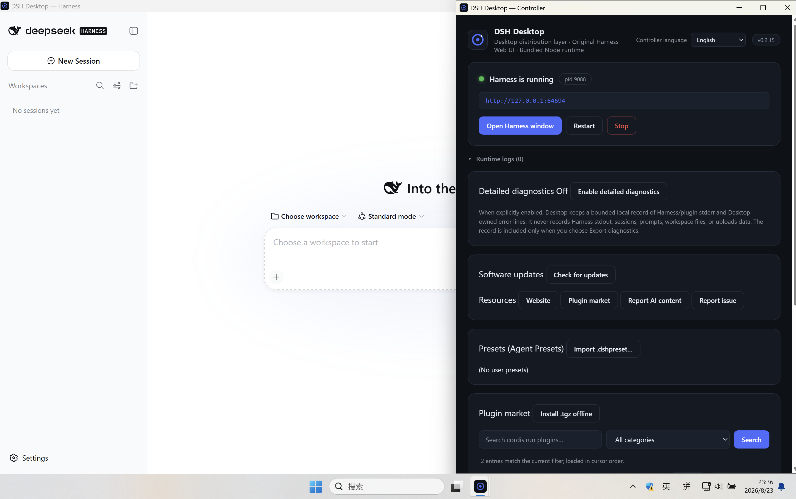

# DSH Desktop

Packages the official DeepSeek Harness as a native Windows / macOS / Linux app, with
the Harness **plugin ecosystem** ready to go. Not a fork: the Harness ships
intact; the desktop layer only handles lifecycle and the security boundary.

<p align="center">
  
</p>

| Repo | [web-casa/DeepSeek-Harness-Desktop](https://github.com/web-casa/DeepSeek-Harness-Desktop) |
| Downloads | [Releases](https://github.com/web-casa/DeepSeek-Harness-Desktop/releases) |
| Website | [dsharness.app](https://dsharness.app) |
| Plugin marketplace | [cordis.run](https://cordis.run) |
| Docs | [SECURITY](SECURITY.md) · [FORKING](FORKING.md) · [RELEASING](RELEASING.md) · [AGENTS](AGENTS.md) |
| Current version | v0.2.17 · Windows x64/ARM64 EXE/MSI · macOS x64/arm64 DMG · Linux x64/arm64 AppImage/DEB/RPM/Flatpak · Snap Store delivery is ready but not public yet · signed/notarized macOS · [中文](README.md) |

> **macOS users**: starting with v0.2.9, DMGs are signed with Developer ID
> Application, notarized by Apple, stapled, and rechecked with Gatekeeper.
> Download only from this repository's Releases; if an official installer is
> still blocked, preserve the diagnostics and report it in a repository issue.

> **Windows users**: before first launch, install the latest supported
> [Microsoft Visual C++ Redistributable (v14)](https://learn.microsoft.com/en-us/cpp/windows/latest-supported-vc-redist?view=msvc-170#latest-supported-redistributable-version)
> that matches the installer architecture. A missing or outdated runtime can
> cause launch errors such as missing `VCRUNTIME140*.dll` or `MSVCP140*.dll`;
> download it only from Microsoft's official page.

| Platform | GitHub Release packages |
|---|---|
| Windows | Native x64 and ARM64: multilingual NSIS `*-setup.exe`, WiX `.msi` |
| macOS | arm64 and x64 `.dmg` |
| Linux | x64 and arm64 `.AppImage`, `.deb`, `.rpm`, `.flatpak` |

The future Snap Store package is named `dsh-desktop-community` and titled
**DSH Desktop (Community)**. It will be a strictly confined, native x64/arm64
Snap. Account ownership and Store onboarding are still being completed, so
there is no public install command yet. Once released, Snap Store/`snapd` —
not the in-app updater — will manage updates.

Every public installer has a same-name `.sha256` sidecar. The x64/arm64
Microsoft Store MSIX packages remain separate, unsigned Partner Center
workflow artifacts. They are Store-signing inputs, not public sideload files.

An MSI filename ending in `_en-US` or `_zh-CN` describes the **installer UI
language only**, not the Desktop controller's available languages: both
packages include Simplified Chinese and English in the controller. NSIS ships
one installer containing both language resources and can follow the system or
offer an explicit choice. The release workflow verifies each native MSI's
actual `ProductLanguage`, so the suffix is never merely cosmetic.

## Features

| | |
|---|---|
| 🔌 **Plugin ecosystem** | Cordis plugins ship with the bundle; in-app marketplace search/install; safe preset import/export |
| 🔄 **Auto-updater** (Windows NSIS) | x64 and ARM64 payloads are separately verified by an embedded minisign pubkey; MSI, Microsoft Store, Snap, macOS and other Linux formats retain their own safe update paths |
| 💓 **Hung-process self-healing** | Heartbeat detects an unresponsive Harness and restarts it (backoff + cap) |
| 🛡️ **Security boundary** | Harness window has zero IPC; app commands granted to the local window only; env sanitization |
| 🔒 **Privacy defaults** | Session telemetry OFF; child env sanitized (NODE_OPTIONS, loader injection keys, …) |
| 🧰 **Diagnostics & feedback** | One-click diagnostics zip (best-effort redaction), copy diagnostics, prefilled issue reports; an explicit detailed mode keeps bounded local stderr/Desktop-error evidence for a reproduction only |
| 🪟 **Desktop UX** | Single instance, window-state memory, crash auto-restart, macOS close-to-tray; the tray exposes Controller/Harness, start/restart, and stop only when the live Harness state permits it; controller, tray, and macOS menu language can follow the system or be set to Simplified Chinese / English, with synchronized window titles while the product name remains DSH Desktop |

## ✨ Plugin ecosystem

The Harness's skills, tools, model routes, MCP integrations and presets are
**all Cordis plugins**.

**Discover**: the settings page links straight to the plugin marketplace,
[cordis.run](https://cordis.run).

**Install**: the settings page's "Plugins (user-installed)" section takes an
npm package name and installs/uninstalls it — the desktop layer drives the
official `dsh plugin --profile web add/remove`, with both the pinned CLI and
pnpm bundled (**no system pnpm needed**), live install logs, and cancel
(cleaning the whole node → dsh → pnpm process tree).

On a cordis.run plugin page, "Install in desktop app" opens
`dsharness://plugin/install?v=1&name=<package>&source=<plugin-page>`. The
desktop shell validates the URL strictly in Rust, uses it only to locate the
canonical marketplace slug, refetches the detail and current `entryRevision`,
and then asks for installation confirmation. Older desktop builds and market
pages without the deep-link button can still use copy-paste package names.
Command-line equivalent (for power users):

```bash
# macOS
DSH_HOME="<dshHome from the diagnostics page>" node "/Applications/DSH Desktop.app/Contents/Resources/runtime/harness/node_modules/@deepseek-ai/dsh/lib/bin.js" plugin --profile web add <package-name>
# Windows PowerShell
$env:DSH_HOME="<dshHome from the diagnostics page>"; node "<install-dir>\runtime\harness\node_modules\@deepseek-ai\dsh\lib\bin.js" plugin --profile web add <package-name>
```

Plugins land in `<dshHome>/profiles/web/` (user data, never the install
directory); hit "Restart Harness" in the app to activate.

After an interrupted upgrade or a manual package deletion, the controller
also performs a read-only Web-profile drift check: a `package.json`
declaration whose direct package entry is absent. It never rewrites user
configuration automatically. Only a demonstrably simple, configuration-free
`cordis.patch.yml` entry for an **inactive** package is offered in an itemized
preview and requires a second confirmation before removal; enabled bundles,
links, complex YAML, and uncertain states are reported for manual/Harness
repair only.

### Detailed diagnostics (opt-in)

The controller normally persists only bounded lifecycle facts. If a problem
needs a fuller error trace, enable **Detailed diagnostics**, restart Harness,
and reproduce it. While enabled, Desktop records only bounded, best-effort
redacted **stderr** from Harness/plugin operations plus Desktop-owned errors;
it does not record Harness stdout, sessions, prompts, workspace files, or
upload anything. The record is included only when you explicitly export a
diagnostics zip. Disable it when finished and use **Clear detailed logs** once
the exported archive is no longer needed; stderr can still contain private
information, so inspect every file before sharing.

**Presets** (`.dshpreset`): a set of plugin rows packaged as a shareable agent
configuration. The settings page offers safe import/export/delete —
path/symlink/quota/secret validation → two-phase confirmation → atomic
install into `<dshHome>/.agent-presets/`, visible in the Harness settings
immediately. The settings page also re-validates preset-root health on every
look: broken (missing/unreadable/empty `agent.cordis.yml` — upstream refuses
to mount), unsafe (symlinks and other id-occupying entries upstream skips),
and missing metadata (`preset.yml`) rows are surfaced and deletable. Before
deleting: the desktop layer removes the directory directly and does not
touch the Harness's default-preset setting — if you delete the current
default, pick another default in the Harness settings or the next session
may fail to start.

> ⚠️ **Trust model**: plugins and presets run inside the Harness process
> with **the same privileges as the Agent**. The desktop validation blocks
> malformed archives, not hostile content in a trusted package — only
> install from trusted sources. See [SECURITY.md](SECURITY.md).

## Architecture

```
Tauri 2 shell
 ├─ bootstrap window: local Svelte UI · limited desktop IPC (ACL-gated)
 └─ harness window: http://127.0.0.1:<random port> · original Harness Web UI · zero IPC
        │ NDJSON (stdin/stdout)
dsh-sidecar (Rust, no heavy dependencies)
 ├─ start/stop/restart · readiness · heartbeat · tree cleanup
 └─ Unix process group / Windows Job Object
        │
Bundled Node 24 + @deepseek-ai/dsh (pinned)
 └─ node lib/bin.js web --host 127.0.0.1 --port 0 · DSH_HOME isolated from the CLI
```

## Core principles

1. **Never fork**: pin `@deepseek-ai/dsh` only; an upstream release = a
   version bump + CI smoke.
2. **Never modify the Web UI**: the original UI loads as-is; `--port 0` +
   the readiness line is the whole handshake.
3. **Security boundary**: the harness window's capability set is empty;
   app commands are ACL-granted to the bootstrap window only.
4. **Single source of truth**: `runtime/runtime-manifest.json`.

## Development

```bash
pnpm install && pnpm check && pnpm check:scripts   # deps + type checks
pnpm runtime:all && pnpm runtime:verify           # stage runtime + e2e smoke
pnpm test:scripts && pnpm test:frontend           # scripts + frontend security logic tests (zero deps)
pnpm tauri dev                                    # desktop dev mode
```

> Read-only `~/.cargo`? `export CARGO_HOME=<repo>/.tmp/cargo-home`.

### Quality gates

| Layer | Gates |
|---|---|
| Frontend | `tsc --noEmit` + `svelte-check`, 0 errors |
| Rust | `cargo nextest` (sidecar and Tauri, also run on a Windows host) · llvm-cov ≥50%/55% · `clippy -D warnings` |
| Supply chain | `cargo deny` · `cargo vet --locked` (70 full + 2 delta + exemptions) · `npm audit`/`pnpm audit` block high |
| Security scan | CodeQL (rust/js-ts/actions) · Dependency Review (lockfile fallback when Graph is unavailable) |
| Bundles | one `verify-bundle` contract across 7 public formats / 16 public installers + fail-closed Windows/macOS signing checks + per-package SHA-256 |
| Release | 5-minute load soak · updater artifacts + `latest.json` |

### Layout

```
crates/dsh-sidecar/   Rust supervisor        runtime/    pin + lock + allowlist
scripts/              build/smoke/verify     src/        Svelte frontend
src-tauri/            Tauri shell (state machine / ACL / preset boundary)
deny.toml + supply-chain/   policy & audits   .github/workflows/   CI
```

## Release & versioning

- CI: pushes/PRs run quality gates + three-platform smoke; a `v*` tag builds
  six **native** targets (Windows x64/ARM64, macOS x64/arm64, Linux x64/arm64)
  plus Store MSIX x64/arm64, then gates the complete inventory before creating
  a draft release, generating and validating `latest.json`, and only then
  publishing the release. A separate Snap workflow also builds strict native
  x64/arm64 packages from the same source: it verifies the local DEB before
  repackaging, then verifies the final Snap, deep link, and persistent-data
  launcher; candidate upload still requires explicit protected-environment
  approval. Every lane checks the Node/Rust host
  triple and payload architecture; Windows on ARM also runs an x64
  compatibility-install smoke without calling that build native.
- Microsoft Store: `v*` tags also build x64/arm64 MSIX packages
  (`build-msix` job; Store mode disables in-app updates and restricts plugins
  to the cordis.run reviewed list). MSIX artifacts are workflow artifacts for
  Partner Center upload, not GitHub Release assets.
- Harness upgrades follow the startup-contract checklist in
  [AGENTS.md](AGENTS.md); the release flow lives in [RELEASING.md](RELEASING.md).
- Current release: v0.2.17, including six native build targets, Windows
  x64/ARM64 installers and English/Simplified-Chinese MSI packages, macOS
  Developer ID signing/notarization, the Cordis v4 marketplace contract,
  diagnostic resilience, safe plugin recovery, and the strict Snap x64/arm64
  candidate-delivery path. The historical v0.2.13 `_en-US` suffix means only
  that its installer UI was English.
- Known limits: Windows GitHub installers do not yet have Authenticode and may
  trigger SmartScreen; in-app updating accepts only a payload exactly matching
  the current CPU architecture and NSIS installer family (MSI never switches
  itself to NSIS); macOS still needs a post-notarization updater archive plus
  a native upgrade smoke; Linux packages have SHA-256 sidecars but no separate
  package-repository signature.
- License: MIT; the bundled Harness and every dependency license ship in
  `runtime/harness/licenses/`.
